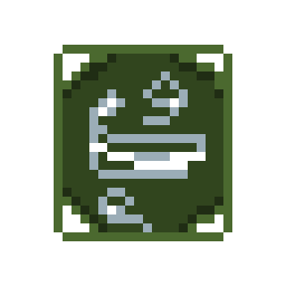

# Ollie. The Game(Java edition)
"Ollie. The Game" is an exciting platformer where you, as the adventurous Ollie, embark on a challenging journey through various worlds, defeating enemies and collecting pickups to reach the ultimate goal - space! Enjoy the original author's soundtrack!

## Gameplay

As Ollie, your mission is to navigate through the game world, defeating enemies to progress further. Utilize the following controls:

- **Move:** `A` and `D` keys
- **Dash:** `Shift` key
- **Fire:** `E` key
- **Pickups:** Collect different pickups to enhance Ollie's abilities and survival.

### Types of Pickups

1. **Healing Pickup**
   - Description: Restores Ollie's health.
   - 

2. **Ammo Pickup**
   - Description: Provides additional ammunition for Ollie's attacks.
   - 

3. **New Attack Pickup**
   - Description: Unlocks a special and powerful attack for Ollie.
   - 

4. **Dash Pickup**
   - Description: Increases the number of dashes Ollie can perform.
   - 

5. **Super Jump Pickup**
   - Description: Grants Ollie the ability to perform a super jump.
   - 

## Getting Started

Follow these steps to start playing Ollie's Space Adventure:

1. **Clone the Repository:**
2. **Open in Your Favorite IDE:**
3. **Add CityEngine.jar from repo to your IDE**
4. **Have fun and help Ollie to defeat space!**

## License

This project is licensed under the [MIT License].

## Final words

Enjoy the game!

